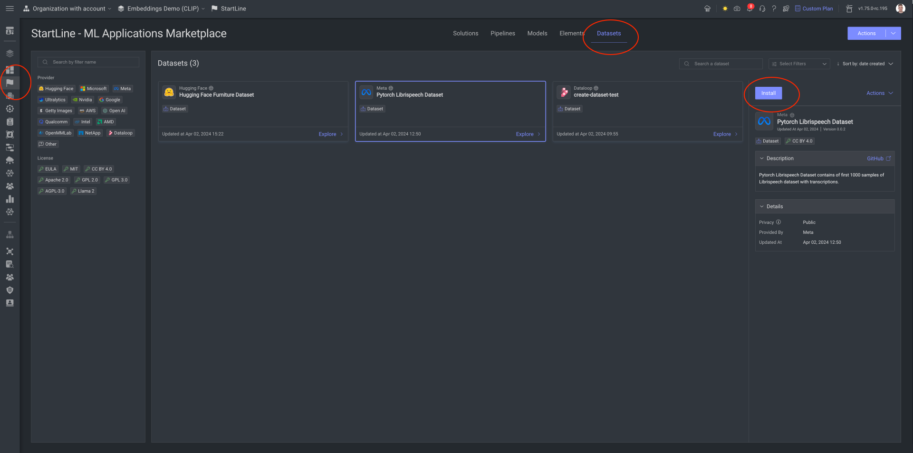
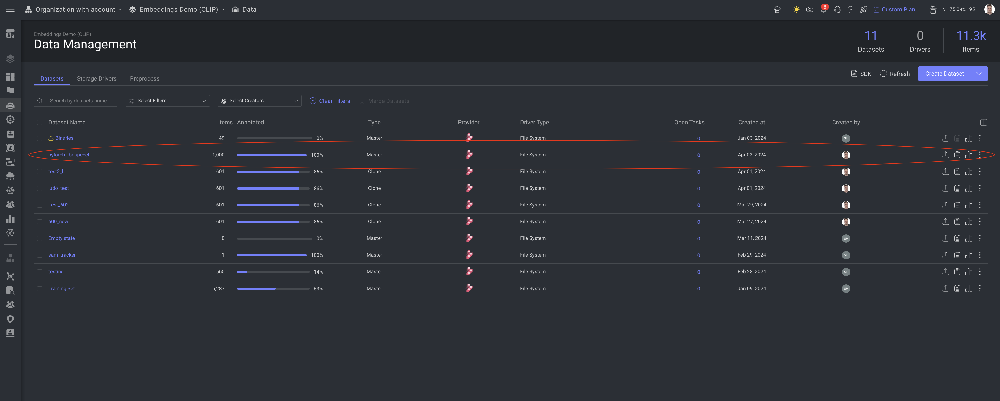

# Dataset adapter for Pytorch Dataset

This dataset adapter is designed to facilitate the transformation of the Librispeech dataset from Pytorch into a format compatible with Dataloop platform. The adapter simplifies the process of importing and preparing the dataset for various machine learning tasks.

## Installation

1. Navigate to **Startline**.
2. Select **Datasets**.
3. Click on **Install**.

After a while, a new dataset will be created and visible under your **Data** section.

